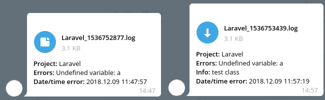

# Telegram logger errors 

Пакет для laravel TLE - Telegram логгер помилок

[](https://packagist.org/packages/jackmartin/telegram-logger-errors) [](https://packagist.org/packages/jackmartin/telegram-logger-errors) [](https://packagist.org/packages/jackmartin/telegram-logger-errors)



> Read this in other language: [English](README.en.md), [Русский](README.md), [Український](README.ua.md)

# Вимоги
* php 7.0
* composer

# Встановлення

Встановити пакет за допомогою composer

```sh
composer require jackmartin/telegram-logger-errors
```

### Laravel Налаштування

Після інсталяції пакета за допомогою composer, зареєструйте сервіс пакета у файлі config/app.php:
```php
Telegram\Bot\Laravel\TelegramServiceProvider::class,
TLE\TLEServiceProvider::class
```

Потім для швидкого виклику класу пакета, додайте псевдонім в цей же файл:
```php
'Telegram' => Telegram\Bot\Laravel\Facades\Telegram::class,
'TLE' => TLE\Facades\TLEFacade::class
```

### Копіюємо файл налаштувань telegram.php, tle.php в config папку

##### Telegram SDK
```sh
php artisan vendor:publish
```
Вибираємо Provider: Telegram\Bot\Laravel\TelegramServiceProvider

##### TLE 
```sh
php artisan vendor:publish
```
Вибираємо Tag: tle-config

або
```sh
php artisan vendor:publish --provider="TLE\TLEServiceProvider" --tag="tle-config"
```

#### Налаштування токена та ім'я бота в config/telegram.php
```php
'bots'  => [
    'common' => [
        'username' => 'Name bot',
        'token'    => 'Token bot',
        'commands' => [],
    ],

],
'default'  => 'common',
```
#### Режим налагодження
```php
'debug' => false
```

#### Ім'я бота

Потрібно для Telegram SDK

```php
'botname' => ''
```

#### Ідентифікатор чата
```php
'chat_id' => ''
```

#### Збереження лога
```php
'save_log' => true
```

#### Шлях збереження тимчасового файлу
```php
'path_save' => 'local'
```

#### Вимкнення запису помилок Telegram у лог файл
```php
'disable_exception_telegram' => false
``` 

## Використання

#### Надсилання простого виключення
```php
use TLE;

try {

    print_r($a);

} catch (\Exception $e) {

    TLE::exp($e)->send();

}
```
#### Надсилання простого виключення + інформацію
```php
use TLE;

try {

    print_r($a);

} catch (\Exception $e) {

    TLE::exp($e)->info('Field check')->send();

}
```
#### Надсилання Guzzle виключення
```php
use TLE;

try {

    print_r($a);

} catch (RequestException $e) {

    TLE::guzzle($e)->send();

}
```

### Додавання класу TLE у глобальний обробник помилок у app\Exceptions\Handler.php
```php
public function report(Exception $exception)
{

    \TLE::exp($exception)->send();

    parent::report($exception);

}
```